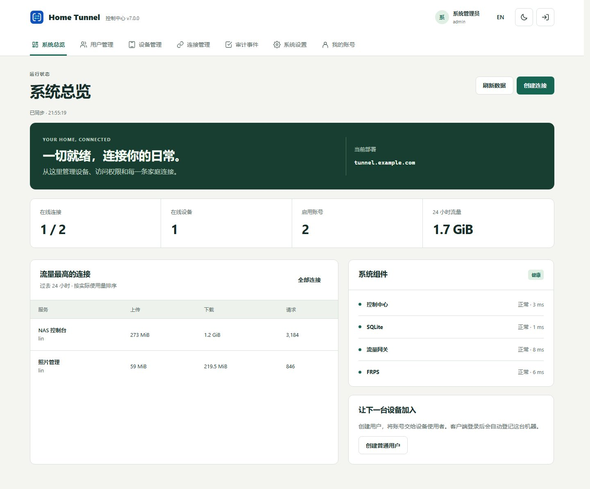

# Home Tunnel

**Self-hosted access to your home services**

 

[简体中文](README.md) · [Website](https://zhanry.github.io/home-tunnel/en/) · [Downloads](https://github.com/ZHanry/home-tunnel/blob/main/docs/DOWNLOADS.md) · [Quick start](https://github.com/ZHanry/home-tunnel/blob/main/docs/GETTING_STARTED.md)

Reach your NAS, Home Assistant, Immich, Jellyfin and other local services through
your own public server. A desktop/NAS Agent runs the tunnels; Web and Android
manage them. Supports HTTP/HTTPS, TCP/UDP and SSH/RDP/RTSP presets without an
account on a hosted relay service.

| Start here | Link |
| --- | --- |
| Deploy a public Linux server | [Server guide](https://github.com/ZHanry/home-tunnel-server/blob/main/docs/SELF_HOSTING.md) · [Server release](https://github.com/ZHanry/home-tunnel-server/releases/tag/v7.0.0) |
| Connect a computer or NAS | [Desktop/CLI release](https://github.com/ZHanry/home-tunnel-client/releases/tag/v7.0.0) · [NAS template](https://github.com/ZHanry/home-tunnel-client/tree/main/packaging/nas) |
| Manage several deployments from your phone | [Android APK](https://github.com/ZHanry/home-tunnel-android/releases/tag/v7.0.0) |
| Configure a home application | [Scenario guide](docs/SCENARIOS.md) |

## What's new in 7.0.0

- Ten-minute single-use enrollment, TOTP MFA, recovery codes and session revocation.
- OS-backed credentials on Windows/macOS/Android; explicit 0600 storage on headless Linux.
- Encrypted Android server/account profiles, device tags/favorites and per-item batch pause/resume.
- Deployment wizard/preflight, redacted diagnostics, host-only administrator recovery,
  encrypted off-host backup and clean-volume restoration, Grafana and nine alert rules.
- Coordinated Web sessions, strictly verified atomic updates, separate ACL version
  conflicts, durable backup health and capability-driven Android transport controls.
- OpenAPI/JSON Schema, a checked compatibility matrix and durable release evidence.

All four repositories and the managed Agent use **7.0.0**. Upstream FRP stays at
**0.70.1**. Windows/macOS currently have no publisher certificates: packages disclose
their unsigned state while the signing/notarization workflow is ready. Android
retains its established release signature. [Verification details](https://github.com/ZHanry/home-tunnel-client/blob/main/docs/PLATFORM_SECURITY.md).

## Connect in three steps

1. Deploy the server on a public Linux host with your domain and Docker Compose.
2. Install the client on a home host and enroll with an account or one-time code.
3. Add a reachable local service and verify its public address from another network.

Android is a management app; tunnels continue on the home host. Administrators
enable TCP/UDP pools and self-service permissions; the server assigns public ports.
Raw transports rely on the target application's authentication and encryption.

[Downloads/compatibility](docs/DOWNLOADS.md) · [API](https://github.com/ZHanry/home-tunnel-server/blob/main/docs/API.md) · [Recovery](https://github.com/ZHanry/home-tunnel-server/blob/main/docs/disaster-recovery.md) · [Monitoring](https://github.com/ZHanry/home-tunnel-server/blob/main/docs/MONITORING.md) · [Contributing](CONTRIBUTING.md) · [Security](SECURITY.md)

Help with a reproducible issue, a real deployment story, documentation or code.
If Home Tunnel is useful to you, a Star or a link from your project helps others
discover it. Never publish credentials or private network details in an issue.
