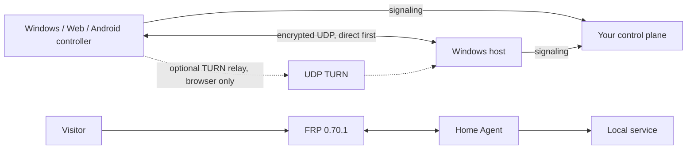
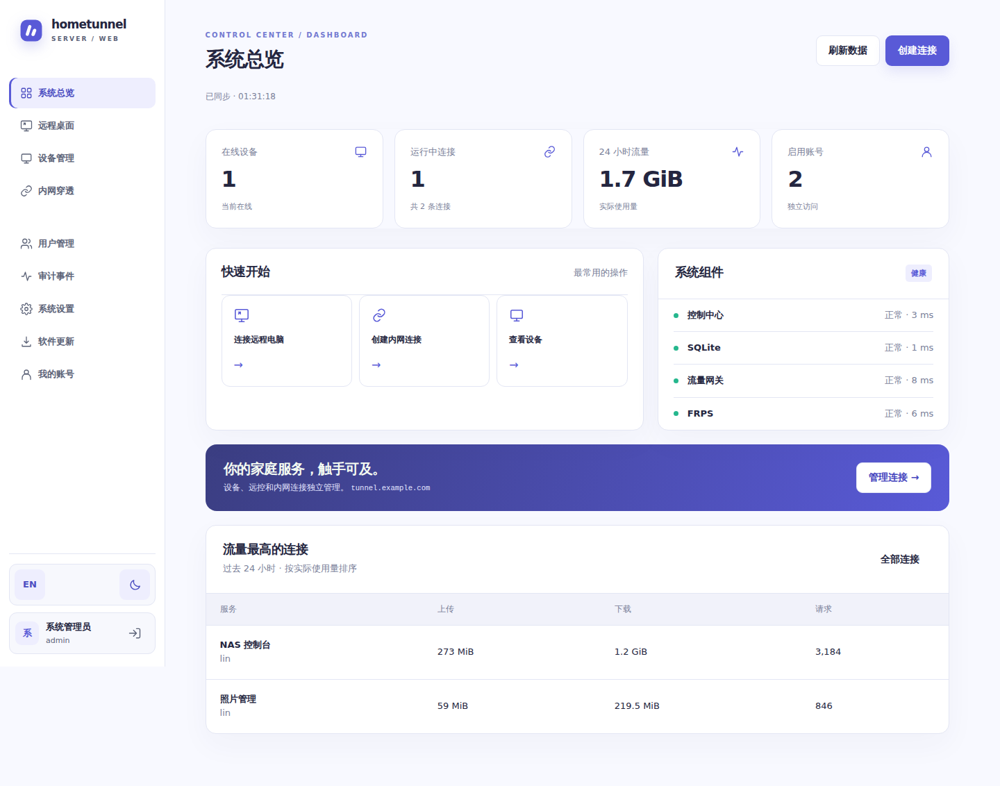
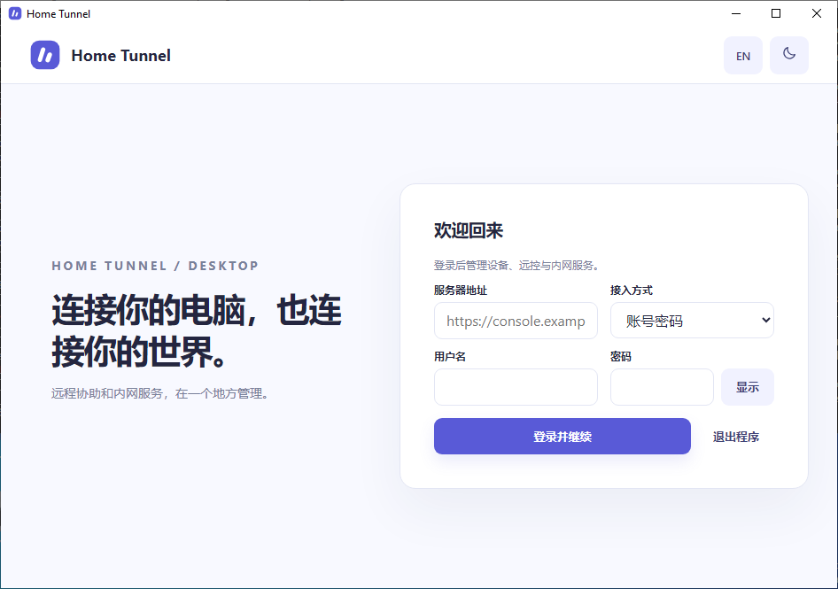

# Home Tunnel

**Two self-hosted paths: authorized UDP remote control, and FRP service publishing.**

[简体中文](README.md) · [Website](https://zhanry.github.io/home-tunnel/en/) · [Downloads](docs/DOWNLOADS.md) · [Quick start](docs/GETTING_STARTED.md) · [Architecture](docs/ARCHITECTURE.md) · [Feature matrix](docs/FEATURE_MATRIX.md)

The stable release is **10.0.0**. Some acceptance gates were not run and remain unverified; the [release notes](docs/RELEASE_NOTES.md) list them. FRP stays at its own **0.70.1**; the API contract is `api-v1.4.0`. Stable and candidate records live in [`distribution.json`](distribution.json). Edit that file and run `python scripts/sync-distribution.py`.

## Start here

| Goal | Entry |
| --- | --- |
| Control an authorized Windows host | [Quick start · remote](docs/GETTING_STARTED.md) · [10.0 scope](docs/RELEASE_NOTES.md) |
| Publish a service from home | [Quick start · FRP](docs/GETTING_STARTED.md) · [Deployment](docs/SELF_HOSTING.md) · [Recipes](docs/SCENARIOS.md) |
| Install what is available now | [10.0.0 downloads and checksums](docs/DOWNLOADS.md) |
| Something failed | [Troubleshooting](docs/TROUBLESHOOTING.md) · [Upgrade](docs/UPGRADING.md) |

## Keep the two paths separate

Remote control requires both sides to sign in to the same self-hosted server. Hosting is on after sign-in; the host approves a request in a bottom-right popup, sets a fixed password, or creates a one-time password. Payloads use end-to-end DTLS-encrypted UDP, direct first. When direct fails, a browser viewer can reach a 10.0.0 host through the server's optional UDP TURN relay, which cannot read the payload. There is no TCP, FRP, HTTP, or WSS fallback. Android controllers and 9.x hosts are direct-only.

Service publishing uses the home Agent and FRP 0.70.1. HTTP/HTTPS, TCP, and UDP use that tunnel. Raw TCP/UDP does not add HTTP sign-in; the target application authenticates itself.

## What 10.0.0 covers

10.0.0 adds authorized system audio, file transfer with SHA-256 checks, a grouped 9-digit device ID, a redesigned browser viewer (floating toolbar, background clipboard sync) and guided service publishing. Android uses the same-source SDK on arm64-v8a and x86_64.

Verified: a Web viewer controlled a Windows 10.0.0 host through the production server, over direct UDP and the relay, with screen, input, Chinese text, clipboard both ways, viewer-to-host files, system audio, the approval popup and the temporary password. These were development builds of the same feature code, not re-run on the final bytes. Host-to-viewer files, Android controlling Windows, physical arm64 phones, upgrade and restore, long-running soaks and the network matrix were not run and remain unverified.

Lock screen, pre-login and UAC secure-desktop control are not available, and there is no microphone return.

Windows and macOS packages have no Authenticode or Developer ID certificate. Android keeps its applicationId and release certificate. SHA-256 and Sigstore build provenance are not publisher signatures.

The [8.0 acceptance record](docs/8.0/ACCEPTANCE.md) is historical. It does not verify 9.0.0 or 10.0.0 bytes. The 9.0.0 notes remain in the release-notes history.

```mermaid
flowchart LR
  Controller[Windows / Web / Android controller] <-->|encrypted UDP, direct first| Host[Windows host]
  Controller -.->|optional TURN relay, browser only| Relay[UDP TURN]
  Relay -.-> Host
  Controller -->|signaling| Control[Your control plane]
  Host -->|signaling| Control
  Visitor[Visitor] --> FRP[FRP 0.70.1]
  FRP <--> Agent[Home Agent]
  Agent --> App[Local service]
```

## 10.0.0 interface

These are actual running 10.0.0 Web screens with local example data. No service was published or remote session established.
The [full gallery](docs/site/en/preview.html) also includes Android API 35 emulator debug captures; these do not establish final APK or real Windows remote-session acceptance.
See [capture sources, environments and hashes](docs/site/assets/v10/README.md).

The official Windows portable app in its native WebView2 sign-in window, with empty isolated state and no account or remote session:

## Contributing

Read [CONTRIBUTING.md](CONTRIBUTING.md). Say whether a report is remote control or FRP, and include the component version plus redacted steps. Security issues follow [SECURITY.md](SECURITY.md) in private.
