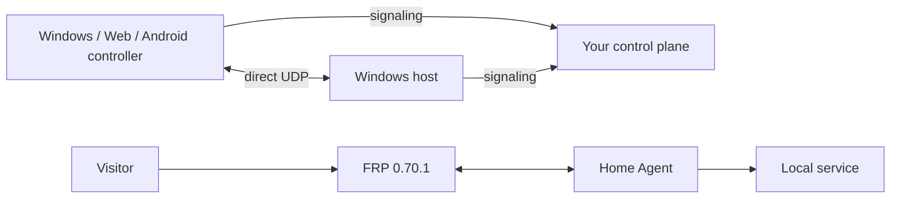
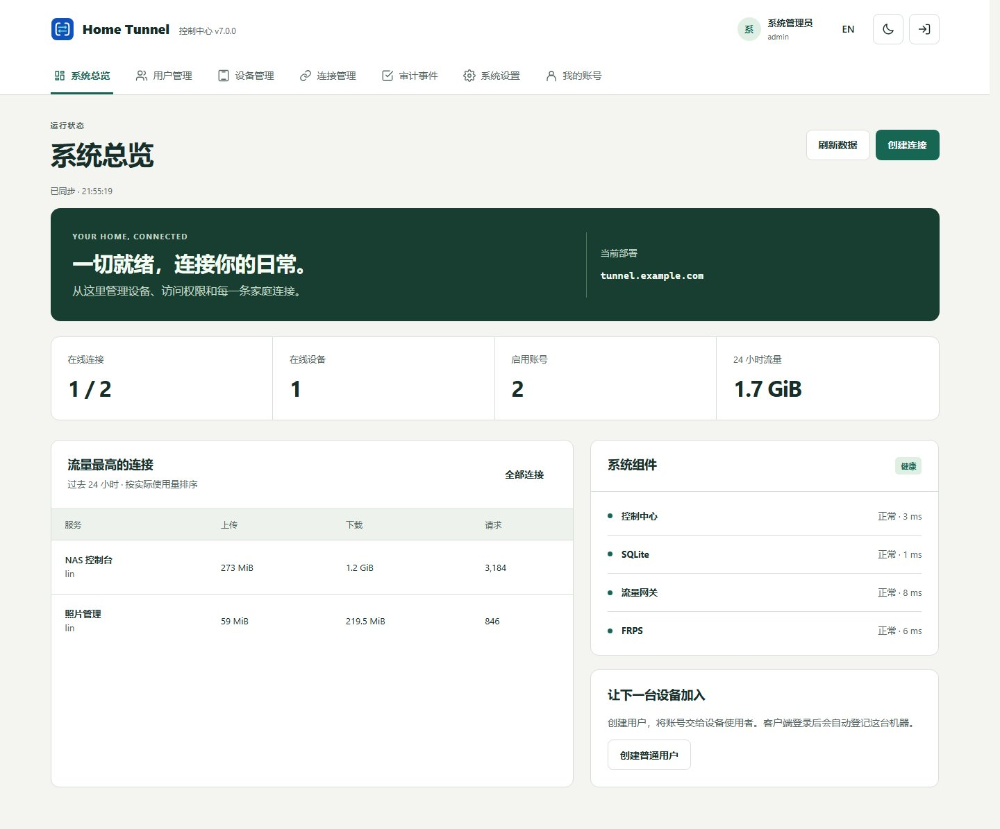

# Home Tunnel

**Two self-hosted paths: authorized UDP remote control, and FRP service publishing.**

[简体中文](README.md) · [Website](https://zhanry.github.io/home-tunnel/en/) · [Downloads](docs/DOWNLOADS.md) · [Quick start](docs/GETTING_STARTED.md) · [Architecture](docs/ARCHITECTURE.md) · [Feature matrix](docs/FEATURE_MATRIX.md)

The development line is **10.0.0**. The installable stable release remains **9.0.0**. 10.0.0 acceptance is pending, and there is no stable package. FRP stays at its own **0.70.1**. Both channels live in [`distribution.json`](distribution.json). Promote by editing that file and running `python scripts/sync-distribution.py`.

## Start here

| Goal | Entry |
| --- | --- |
| Control an authorized Windows host | [Quick start · remote](docs/GETTING_STARTED.md) · [9.0 scope](docs/RELEASE_NOTES.md) |
| Publish a service from home | [Quick start · FRP](docs/GETTING_STARTED.md) · [Deployment](docs/SELF_HOSTING.md) · [Recipes](docs/SCENARIOS.md) |
| Install what is available now | [9.0.0 downloads and checksums](docs/DOWNLOADS.md) |
| Something failed | [Troubleshooting](docs/TROUBLESHOOTING.md) · [Upgrade](docs/UPGRADING.md) |

## Keep the two paths separate

Remote control requires both sides to sign in to the same self-hosted server. The host can approve a request, set a fixed password, or create a one-time password. Picture and input use direct UDP only. A failed path stays failed: there is no TURN, ICE-TCP, FRP, HTTP, or WSS payload fallback.

Service publishing uses the home Agent and FRP 0.70.1. HTTP/HTTPS, TCP, and UDP use that tunnel. Raw TCP/UDP does not add HTTP sign-in; the target application authenticates itself.

## 9.0.0 is published. 10.0.0 is not accepted

9.0.0 includes those remote-control entries, a separate window, and the existing account, device, backup, and monitoring tools. Windows pre-login, lock-screen, and UAC secure-desktop control are not done. Audio is not delivered. Clipboard interoperability, arm64 APK device runtime, cross-network use, and long-running sessions are not accepted.

10.0.0 plans a Windows service/session broker, explicitly enabled unattended access, system audio, bidirectional files with progress and checksums, and an FRP publishing wizard. None of that is supported yet. Secure desktop, audio, and file-transfer acceptance is pending. `api-v1.4.0` is not frozen. The stable contract remains `api-v1.3.0`.

Windows and macOS packages have no Authenticode or Developer ID certificate. Android keeps its applicationId and release certificate. SHA-256 and Sigstore build provenance are not publisher signatures.

The [8.0 acceptance record](docs/8.0/ACCEPTANCE.md) is historical. It does not verify 9.0.0 or 10.0.0 bytes.

```mermaid
flowchart LR
  Controller[Windows / Web / Android controller] <-->|direct UDP| Host[Windows host]
  Controller -->|signaling| Control[Your control plane]
  Host -->|signaling| Control
  Visitor[Visitor] --> FRP[FRP 0.70.1]
  FRP <--> Agent[Home Agent]
  Agent --> App[Local service]
```

The picture below is a historical 7.0.0 console screenshot with example data. It is not a 10.0 remote window or wizard. Empty 10.0 slots are listed in [screenshot-slots.json](docs/site/screenshot-slots.json).

## Contributing

Read [CONTRIBUTING.md](CONTRIBUTING.md). Say whether a report is remote control or FRP, and include the component version plus redacted steps. Security issues follow [SECURITY.md](SECURITY.md) in private.
