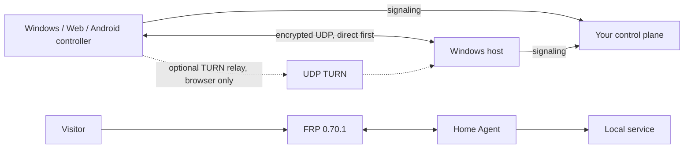

# Home Tunnel

**Two self-hosted paths: authorized UDP remote control, and FRP service publishing.**

[简体中文](README.md) · [Website](https://zhanry.github.io/home-tunnel/en/) · [Downloads](docs/DOWNLOADS.md) · [Quick start](docs/GETTING_STARTED.md) · [Architecture](docs/ARCHITECTURE.md) · [Feature matrix](docs/FEATURE_MATRIX.md)

The stable combination is **Server / Client 10.1.0 + Android 10.0.0**. Android retains its original release files and is not relabeled 10.1.0. Some acceptance gates were not run and remain unverified; the [release notes](docs/RELEASE_NOTES.md) list them. FRP stays at **0.70.1**; Server / Client use frozen additive contract `api-v1.5.0`. Stable and candidate records live in [`distribution.json`](distribution.json). Edit that file and run `python scripts/sync-distribution.py`.

## Start here

| Goal | Entry |
| --- | --- |
| Control an authorized Windows host | [Quick start · remote](docs/GETTING_STARTED.md) · [10.1 scope](docs/RELEASE_NOTES.md) |
| Publish a service from home | [Quick start · FRP](docs/GETTING_STARTED.md) · [Deployment](docs/SELF_HOSTING.md) · [Recipes](docs/SCENARIOS.md) |
| Install what is available now | [10.1.0 downloads and checksums](docs/DOWNLOADS.md) |
| Something failed | [Troubleshooting](docs/TROUBLESHOOTING.md) · [Upgrade](docs/UPGRADING.md) |

## Keep the two paths separate

Remote control requires both sides to sign in to the same self-hosted server. Hosting is on after sign-in; the host approves a request in a bottom-right popup, sets a fixed password, or creates a one-time password. Payloads use end-to-end DTLS-encrypted UDP, direct first. When direct fails, a browser viewer can reach a 10.x host through the server's optional UDP TURN relay, which cannot read the payload. There is no TCP, FRP, HTTP, or WSS fallback. Android controllers and 9.x hosts are direct-only.

Service publishing uses the home Agent and FRP 0.70.1. HTTP/HTTPS, TCP, and UDP use that tunnel. Raw TCP/UDP does not add HTTP sign-in; the target application authenticates itself.

## What 10.1.0 covers

10.1.0 fixes the Windows approval popup background and content timing, blocks connections to the current device, and reuses native sign-in in the remote window through a short-lived, single-use, remote-only handoff. Settings and update controls are combined, current-device rename moves to My Devices, and narrow-window sign-in, scrolling and keyboard behavior improve. The sign-in handoff and current-device rename require Server 10.1.0.

The original 10.1.0 Windows worker bytes passed 30 connections and 7202.463 seconds of activity with 1391 samples, using same-machine Chromium and a production-source QA host in an isolated loopback environment. After an explicit QA host restart, a new pairing restored input in 3507.7 ms. This does not establish full installed-GUI, Windows service, independent Windows-endpoint, Android, network-outage recovery, 24-hour online, or Linux/macOS runtime acceptance.

The 10.0.0 direct/relay, audio, clipboard and file development-build results remain in the release-notes history; they are not new acceptance results for final 10.1.0 bytes. The 24-hour test was not run.

Lock screen, pre-login and UAC secure-desktop control are unavailable, as is microphone return. Windows and macOS still have no Authenticode or Developer ID release signature. Android 10.0.0 retains its applicationId, release certificate and download digests. SHA-256 and Sigstore build provenance are not publisher signatures.

The [8.0 acceptance record](docs/8.0/ACCEPTANCE.md) and the 10.0.0 and 9.0.0 histories cover their own versions, not the 10.1.0 artifacts.

```mermaid
flowchart LR
  Controller[Windows / Web / Android controller] <-->|encrypted UDP, direct first| Host[Windows host]
  Controller -.->|optional TURN relay, browser only| Relay[UDP TURN]
  Relay -.-> Host
  Controller -->|signaling| Control[Your control plane]
  Host -->|signaling| Control
  Visitor[Visitor] --> FRP[FRP 0.70.1]
  FRP <--> Agent[Home Agent]
  Agent --> App[Local service]
```

## 10.0.0 interface

These screenshots keep their 10.0.0 labels and do not depict 10.1.0. They are actual running 10.0.0 Web screens with local example data. No service was published or remote session established.
The [full gallery](docs/site/en/preview.html) also includes Android API 35 emulator debug captures; these do not establish final APK or real Windows remote-session acceptance.
See [capture sources, environments and hashes](docs/site/assets/v10/README.md).

The official Windows portable app in its native WebView2 sign-in window, with empty isolated state and no account or remote session:

## Contributing

Read [CONTRIBUTING.md](CONTRIBUTING.md). Say whether a report is remote control or FRP, and include the component version plus redacted steps. Security issues follow [SECURITY.md](SECURITY.md) in private.
