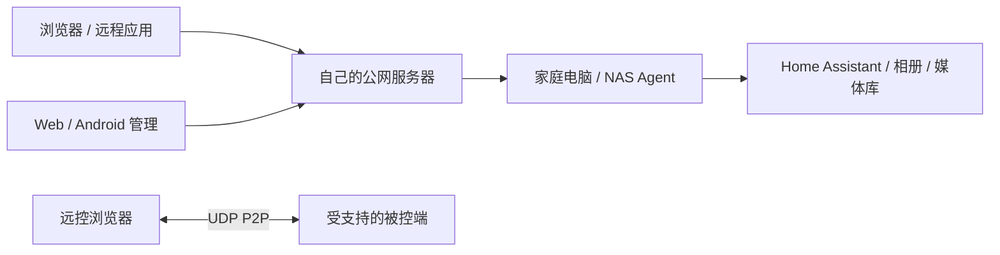

# Home Tunnel 8.0.0

**自托管的家庭服务连接与远程桌面平台**

 

[English](README.en.md) · [项目网站](https://zhanry.github.io/home-tunnel/) · [下载](docs/DOWNLOADS.md) · [快速开始](docs/GETTING_STARTED.md) · [8.0 功能与限制](docs/RELEASE_NOTES.md)

用自己的公网服务器，将家里的 NAS、Home Assistant、Immich、Jellyfin 和其他
本地服务连接到外部网络。电脑/NAS 运行隧道，浏览器和 Android 管理连接。
支持 HTTP/HTTPS、TCP、UDP，以及 SSH/RDP/RTSP 预设。
8.0 增加独立授权的远程桌面：浏览器连接 Windows 被控端，视频、输入和文件只走 UDP P2P；无法直连时明确失败。

## 从这里开始

| 你要做的事 | 入口 |
| --- | --- |
| 部署自己的公网服务端 | [部署指南](https://github.com/ZHanry/home-tunnel-server/blob/main/docs/SELF_HOSTING.md) · [Server 8.0.0](https://github.com/ZHanry/home-tunnel-server/releases/tag/v8.0.0) |
| 连接家中电脑或 NAS | [桌面/CLI 8.0.0](https://github.com/ZHanry/home-tunnel-client/releases/tag/v8.0.0) · [NAS 模板](https://github.com/ZHanry/home-tunnel-client/tree/main/packaging/nas) |
| 手机远程管理多台服务器 | [Android 8.0.0 APK](https://github.com/ZHanry/home-tunnel-android/releases/tag/v8.0.0) |
| 给家庭应用配置连接 | [Home Assistant / Immich / Jellyfin 场景](docs/SCENARIOS.md) |

## 8.0.0 的交付范围

- **Windows 与浏览器**：独立端点身份、配对和本机批准；H.264/VP8 视频、键鼠与中文文本输入、双向多文件通道。文件按权限流式收发并校验 SHA-256。最终 Windows 包的同机验证已覆盖真实视频、输入与文件，最终安装包结果以 Release 证据为准。
- **Linux x64 X11**：被控端只开放观看、键盘和鼠标。已完成隔离 Xvfb 环境验证；实体桌面、锁屏恢复仍待验收，文本、剪贴板、文件在此配置中不可用。Linux arm64/NAS/CLI 继续用于隧道。
- **Android**：保留多服务器管理，接入同源控制端、JNI 与 Surface。真机解码和输入尚未验收；系统音频、麦克风、剪贴板/文件传输、多会话界面及增强编码不可用。
- **原有管理与运维**：继续提供一次性设备接入码、TOTP/恢复码、会话撤销、标签/收藏、批量操作、部署预检、脱敏诊断、加密异机备份和监控。
- **共享接口与发布证据**：REST 保持 `/api/v1`，契约固定为 `api-v1.2.0`；各组件 Release 保存实际产物、摘要和验证材料。

macOS 与 Wayland 被控、桌面原生观看窗口、系统声音、麦克风回传、虚拟麦克风和 AV1/HEVC 尚未交付。Windows 文本剪贴板已有实现，实际系统互通仍未验证；H.264/VP8 当前证据来自软件编码，不能据此认定硬件加速可用。多窗口并发、跨网、完整升级恢复及长期在线验收仍未完成。

**8.0.0 不代表完整方案已全部验收。** 查看 [发布说明](docs/RELEASE_NOTES.md)、[完整范围](docs/8.0/SCOPE.md) 和 [逐项验收](docs/8.0/ACCEPTANCE.md)，按实际能力选择平台。

四个仓库与自有 Agent 使用 **8.0.0**，FRP 保持独立的 **0.70.1**。
Windows/macOS 8.0.0 包没有 Authenticode / Developer ID 发行签名，提供 SHA-256 和 Sigstore 构建证明；Android 沿用原 applicationId 和发行证书。
[验证与签名说明](https://github.com/ZHanry/home-tunnel-client/blob/main/docs/PLATFORM_SECURITY.md)。

## 三步连接

1. 准备公网 Linux 主机、域名和 Docker Compose，部署服务端并修改初始管理员密码。
2. 在家庭电脑/NAS 安装客户端，通过账号或一次性接入码登记设备。
3. 添加本地服务，等待在线，复制地址并从外部网络验证访问。

TCP/UDP 隧道需要管理员开放端口池并授权，公网端口由服务端分配。原始 TCP/UDP
不附带 HTTP 白名单或 Basic Auth，使用目标应用的认证与加密。

远程桌面另需浏览器与被控端配对、核对配对码并在本机批准。服务器负责身份、授权和信令；画面、输入与文件只走两端 UDP 直连，不提供 TURN 或隧道中转回退。具体操作见 [快速开始](docs/GETTING_STARTED.md)。

## 界面与架构

以下保留 7.0.0 控制台示例截图，未将历史图片作为 8.0 远程桌面演示。

[下载与兼容性](docs/DOWNLOADS.md) · [升级](https://github.com/ZHanry/home-tunnel-server/blob/main/docs/UPGRADING.md) · [账号安全](https://github.com/ZHanry/home-tunnel-server/blob/main/docs/ACCOUNT_SECURITY.md) · [备份恢复](https://github.com/ZHanry/home-tunnel-server/blob/main/docs/disaster-recovery.md) · [监控](https://github.com/ZHanry/home-tunnel-server/blob/main/docs/MONITORING.md) · [API](https://github.com/ZHanry/home-tunnel-server/blob/main/docs/API.md)

7.0.0 历史产物继续保留：[Server](https://github.com/ZHanry/home-tunnel-server/releases/tag/v7.0.0) · [Client](https://github.com/ZHanry/home-tunnel-client/releases/tag/v7.0.0) · [Android](https://github.com/ZHanry/home-tunnel-android/releases/tag/v7.0.0)。升级前先备份；8.0 连接旧服务端时不提供新的远控能力。

## 参与项目

先阅读 [贡献指南](CONTRIBUTING.md)。问题反馈请提供组件版本、平台、复现步骤和脱敏
诊断结果，切勿公开密码/接入码。安全问题按 [SECURITY.md](SECURITY.md) 私下报告。
欢迎分享实际部署经验、提交可复现问题或改进文档。
