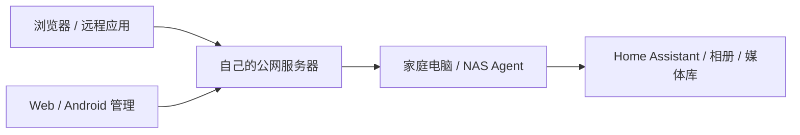

# Home Tunnel

**自托管的家庭服务连接平台**

 

[English](README.en.md) · [项目网站](https://zhanry.github.io/home-tunnel/) · [下载](https://github.com/ZHanry/home-tunnel/blob/main/docs/DOWNLOADS.md) · [快速开始](https://github.com/ZHanry/home-tunnel/blob/main/docs/GETTING_STARTED.md)

用自己的公网服务器，将家里的 NAS、Home Assistant、Immich、Jellyfin 和其他
本地服务安全地连接到外部网络。电脑/NAS 运行隧道，浏览器和 Android 管理连接。
支持 HTTP/HTTPS、TCP、UDP，以及 SSH/RDP/RTSP 预设；不依赖第三方托管中转账号。

## 从这里开始

| 你要做的事 | 入口 |
| --- | --- |
| 部署自己的公网服务端 | [部署指南](https://github.com/ZHanry/home-tunnel-server/blob/main/docs/SELF_HOSTING.md) · [Server 7.0.0](https://github.com/ZHanry/home-tunnel-server/releases/tag/v7.0.0) |
| 连接家中电脑或 NAS | [桌面/CLI 7.0.0](https://github.com/ZHanry/home-tunnel-client/releases/tag/v7.0.0) · [NAS 模板](https://github.com/ZHanry/home-tunnel-client/tree/main/packaging/nas) |
| 手机远程管理多台服务器 | [Android 7.0.0 APK](https://github.com/ZHanry/home-tunnel-android/releases/tag/v7.0.0) |
| 给家庭应用配置连接 | [Home Assistant / Immich / Jellyfin 场景](docs/SCENARIOS.md) |

## 7.0.0 的重点

- **接入与账号安全**：10 分钟一次性设备接入码、TOTP 双重验证、恢复码、会话撤销；Windows DPAPI、macOS Keychain、AndroidKeyStore。
- **日常管理**：Android 加密保存多服务器/账号；Web、桌面、手机的设备标签、收藏、批量暂停/恢复，逐项报告结果。
- **完整的运维路径**：部署向导与预检、脱敏诊断包、唯一管理员离线恢复、加密异机备份、干净卷恢复验证、Grafana 和 9 条告警规则。
- **可靠性修复**：Web 多标签页会话协调、严格校验的原子更新、独立访问策略并发保护、持久化备份健康、手机端口池与能力发现。
- **公开的交付依据**：API 1.1/OpenAPI/JSON Schema、兼容矩阵、跨平台检查；校验清单、SBOM、构建证明和扫描结果随 Release 保存。

四个仓库与自有 Agent 统一为 **7.0.0**，FRP 使用独立的 **0.70.1** 版本。
Windows/macOS 暂无平台发行证书，包内明确标注未签名；签名/公证流程已接入。
Android 使用既有正式签名。[验证与签名说明](https://github.com/ZHanry/home-tunnel-client/blob/main/docs/PLATFORM_SECURITY.md)。

## 三步连接

1. 准备公网 Linux 主机、域名和 Docker Compose，部署服务端并修改初始管理员密码。
2. 在家庭电脑/NAS 安装客户端，通过账号或一次性接入码登记设备。
3. 添加本地服务，等待在线，复制地址并从外部网络验证访问。

TCP/UDP 需要管理员开放端口池并授权，公网端口由服务端自动分配。原始 TCP/UDP
不附带 HTTP 白名单或 Basic Auth，必须使用目标应用的认证与加密。

## 界面与架构

[下载与兼容性](docs/DOWNLOADS.md) · [升级](https://github.com/ZHanry/home-tunnel-server/blob/main/docs/UPGRADING.md) · [账号安全](https://github.com/ZHanry/home-tunnel-server/blob/main/docs/ACCOUNT_SECURITY.md) · [备份恢复](https://github.com/ZHanry/home-tunnel-server/blob/main/docs/disaster-recovery.md) · [监控](https://github.com/ZHanry/home-tunnel-server/blob/main/docs/MONITORING.md) · [API](https://github.com/ZHanry/home-tunnel-server/blob/main/docs/API.md)

## 参与项目

先阅读 [贡献指南](CONTRIBUTING.md)。问题反馈请提供组件版本、平台、复现步骤和脱敏
诊断结果，切勿公开密码/接入码。安全问题按 [SECURITY.md](SECURITY.md) 私下报告。
如果项目帮助你解决了真实需求，欢迎 Star、分享使用场景或提交文档改进。
