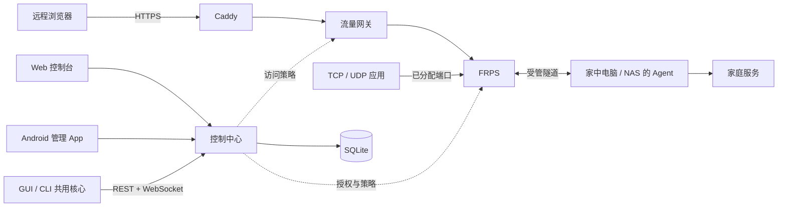

  
  <h1>Home Tunnel</h1>
  
<strong>面向个人与家庭服务的自托管内网穿透平台</strong>

  

    
    
    
  

  
<a href="README.en.md">English</a> · <a href="https://zhanry.github.io/home-tunnel/">项目网站</a>

通过自己的公网服务器，访问家中的 NAS、相册、Home Assistant 和其他服务。Home Tunnel 在 FRP 之上提供账号、设备、连接、访问策略和运行状态的集中管理。

> **开发状态：内部测试。** 当前以功能验证、联调和安装体验完善为主，尚未发布面向生产环境的稳定版本。接口、配置和安装方式可能调整。

## 项目能做什么

- **发布家庭服务**：HTTP / HTTPS、通用 TCP 和固定端口 UDP；RTSP-over-TCP 可使用 TCP 映射。
- **集中管理**：Web 控制台管理账号、设备与连接，普通用户只看到自己的资源。
- **控制访问**：Web 路径支持访问限制、速率限制与流量统计；设备通过受管配置和短期授权接入。
- **多端使用**：电脑使用 GUI，NAS 或无桌面主机使用 CLI，Android App 负责远程管理。

## 从哪个仓库开始

| 仓库 | 负责内容 | 适合谁 |
| --- | --- | --- |
| [home-tunnel-server](https://github.com/ZHanry/home-tunnel-server) | API、Web 控制台、流量网关、Caddy / FRPS 部署 | 搭建测试环境、开发服务端 |
| [home-tunnel-client](https://github.com/ZHanry/home-tunnel-client) | Windows / macOS / Linux 的 GUI、CLI、客户端核心与 Agent | 在电脑或 NAS 上运行隧道、开发客户端 |
| [home-tunnel-android](https://github.com/ZHanry/home-tunnel-android) | Android 远程管理 App | 使用手机管理已有设备与连接 |
| **本仓库** | 项目介绍、网站、通用文档和协作入口 | 了解整体架构、规划与测试流程 |

GUI 和 CLI 共用一套客户端核心，按平台分别打包。Android 管理家中设备上的隧道，实际转发由电脑或 NAS 完成。

## 工作方式

HTTP 流量经过 Caddy 和网关；TCP / UDP 使用管理员分配的端口，应用自身负责认证和加密。协议范围和组件边界见 [架构说明](docs/ARCHITECTURE.md)。

## 开始一次测试

1. **搭建服务端**：准备一台公网 Linux 主机、域名及 DNS，按[服务端指南](https://github.com/ZHanry/home-tunnel-server/blob/main/docs/SELF_HOSTING.md)从源码构建测试环境。
2. **接入家庭设备**：从[客户端仓库](https://github.com/ZHanry/home-tunnel-client#readme)构建完整安装包，登录并注册电脑或 NAS。
3. **创建连接并验证**：先连接一个简单的 HTTP 服务，检查访问、暂停、恢复与重连，再测试其他功能。手机管理入口见 [Android 仓库](https://github.com/ZHanry/home-tunnel-android#readme)。

当前以源码构建为主要体验方式。测试包、使用前提与建议测试顺序见 [开始使用](docs/GETTING_STARTED.md)；各平台操作以对应代码仓库的 README 为准。

## 界面预览

截图来自开发环境，使用测试数据；项目网站提供静态介绍和预览。

## 当前范围

| 部分 | 开发目标 | 当前验证重点 |
| --- | --- | --- |
| 服务端 | Linux amd64 / arm64 | 配置生成、权限、HTTP / TCP / UDP、备份恢复 |
| GUI | Windows / macOS / Linux | 登录、设备注册、窗口托盘、连接同步 |
| CLI | Linux / macOS 无界面主机，Windows 命令行构建 | 后台运行、状态查看、连接管理、断线恢复 |
| Android | Android 8.0+，优先验证 arm64 设备 | 登录与会话、设备列表、连接编辑、错误恢复 |

CI 构建和自动化测试是开发检查，不等同于所有真实设备、网络和长期运行场景的验证。

## 文档与参与

- [开始使用](docs/GETTING_STARTED.md)：准备环境、选择客户端、完成第一次联调。
- [仓库职责](docs/REPOSITORIES.md)：代码归属、接口约定和跨组件修改方式。
- [测试指南](docs/TESTING.md)：验证场景与反馈信息。
- [开发路线](docs/ROADMAP.md)：当前重点与后续准备事项。
- [贡献指南](CONTRIBUTING.md) · [安全报告](SECURITY.md) · [开发记录](CHANGELOG.md)。

组件问题提交到对应仓库；网站、通用文档和跨组件建议留在本仓库。提交反馈时附平台、构建提交与复现步骤，使用测试数据替代真实凭据。

## 许可证

Home Tunnel 使用 [Apache License 2.0](LICENSE)。Agent 使用的 FRP 许可和第三方声明随[客户端源码](https://github.com/ZHanry/home-tunnel-client/tree/main/agent)一起维护。
