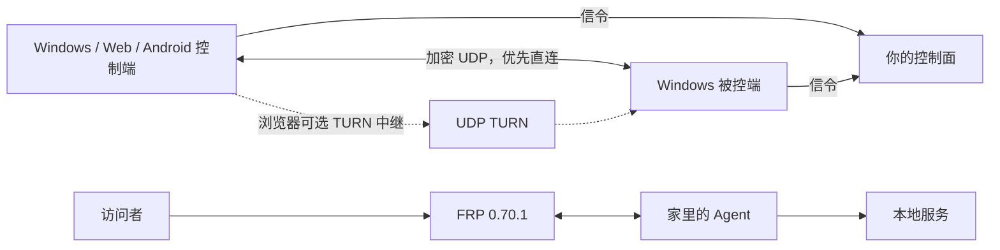

# Home Tunnel

**自托管的两条路径：授权后的 UDP 远控，以及 FRP 服务发布。**

[English](README.en.md) · [网站](https://zhanry.github.io/home-tunnel/) · [下载](docs/DOWNLOADS.md) · [快速开始](docs/GETTING_STARTED.md) · [架构](docs/ARCHITECTURE.md) · [功能矩阵](docs/FEATURE_MATRIX.md)

当前稳定版是 **10.0.0**，带负责人豁免发布：部分验收项目没有运行，豁免不等于通过，清单见 [发布说明](docs/RELEASE_NOTES.md)。FRP 保持独立的 **0.70.1**，API 契约为 `api-v1.4.0`。稳定通道和候选记录写在同一个 [`distribution.json`](distribution.json) 里；改这一份后运行 `python scripts/sync-distribution.py`。

## 从这里开始

| 你要做的事 | 入口 |
| --- | --- |
| 授权后远程操作一台 Windows 主机 | [快速开始 · 远控](docs/GETTING_STARTED.md) · [10.0 范围](docs/RELEASE_NOTES.md) |
| 把家里的服务发布到公网 | [快速开始 · FRP](docs/GETTING_STARTED.md) · [部署](docs/SELF_HOSTING.md) · [场景](docs/SCENARIOS.md) |
| 安装现在能用的版本 | [10.0.0 下载与校验](docs/DOWNLOADS.md) |
| 出了问题 | [排查](docs/TROUBLESHOOTING.md) · [升级](docs/UPGRADING.md) |

## 两条路径不要混用

远控要求双方登录同一台自托管服务器。被控端登录即开启被控，可以在右下角审批请求、设置固定密码，或生成一次性临时密码。载荷走端到端 DTLS 加密的 UDP，优先直连；直连失败时，浏览器控制端可以经服务器可选的 UDP TURN 中继连接 10.0.0 被控端，中继读不到内容。没有 TCP、FRP、HTTP 或 WSS 回退。Android 控制端和 9.x 被控端只走直连。

服务发布使用家里的 Agent 和 FRP 0.70.1。HTTP/HTTPS、TCP 和 UDP 走这条隧道。TCP/UDP 不附带 HTTP 登录保护，认证由目标应用自己完成。

## 10.0.0 的范围

10.0.0 增加授权后的系统声音、带 SHA-256 校验的文件传输、分组 9 位设备 ID、重做的浏览器控制端（浮动工具栏、后台剪贴板同步）和引导式服务发布。Android 的 arm64-v8a 与 x86_64 使用同源 SDK。

实测范围：Web 控制端经生产服务器控制 Windows 10.0.0 被控端，直连和中继都通过了画面、键鼠、中文、双向剪贴板、控制端到被控端的文件、系统声音、审批弹窗和临时密码。这是同一功能代码的开发构建，没有在最终字节上重跑。被控端到控制端的文件、Android 控制 Windows、实体 arm64 手机、升级恢复、长时间运行和网络矩阵等由负责人豁免，没有验证。

锁屏、登录前和 UAC 安全桌面控制不可用，也没有麦克风回传。

Windows 和 macOS 没有 Authenticode 或 Developer ID 发行证书。Android 沿用原来的 applicationId 和发行证书。SHA-256 与 Sigstore 构建证明不是发行商签名。

[8.0 历史验收](docs/8.0/ACCEPTANCE.md) 只记录当时的结果，不能代替 9.0.0 或 10.0.0 的产物。9.0.0 的记录保留在发布说明的历史部分。

```mermaid
flowchart LR
  Controller[Windows / Web / Android 控制端] <-->|加密 UDP，优先直连| Host[Windows 被控端]
  Controller -.->|浏览器可选 TURN 中继| Relay[UDP TURN]
  Relay -.-> Host
  Controller -->|信令| Control[你的控制面]
  Host -->|信令| Control
  Visitor[访问者] --> FRP[FRP 0.70.1]
  FRP <--> Agent[家里的 Agent]
  Agent --> App[本地服务]
```

## 10.0.0 界面

以下为实际运行的 10.0.0 Web 界面，使用本地示例数据，未发布服务或建立远控会话。
[完整界面预览](docs/site/preview.html)还包含 Android API 35 模拟器的 debug 截图；它们不能代替最终 APK 或真实 Windows 远控验收。
[截图来源、环境与校验值](docs/site/assets/v10/README.md)。

## 参与项目

先看 [贡献指南](CONTRIBUTING.md)。反馈时写明是远控还是 FRP、组件版本和脱敏后的复现步骤。安全问题按 [SECURITY.md](SECURITY.md) 私下报告。
