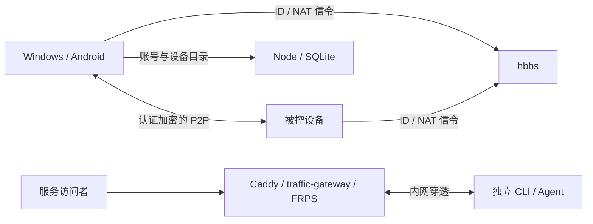

# HomeDesk / Home Tunnel

**暖居界面、严格 P2P 远控、完整内网穿透。四个仓库继续独立发布。**

[English](README.en.md) · [网站](https://zhanry.github.io/home-tunnel/) · [下载与校验](docs/DOWNLOADS.md) · [快速开始](docs/GETTING_STARTED.md) · [架构](docs/ARCHITECTURE.md) · [升级](docs/UPGRADING.md)

当前主线为 **11.0.0 候选版**：Server 11.0.0-rc.2、Client / Android / 总仓 11.0.0-rc.1。整合 ymhaha 的 Hearth Web 与 Rust/Flutter 客户端；Windows 使用原生 HomeDesk，Android 固定同一份 Client 源码。跨网络 NAT、长期媒体、真机和两台安装后终端的远控验收尚未完成，不晋升稳定版。

`distribution.json` 是通道与实际附件的唯一来源。稳定通道仍为 Server / Client 10.1.0 + Android 10.0.0；旧发布、标签、哈希与验收材料保留，其远控结果不作为 11.x 已通过的证据。

## 连接方式

远控必须是认证加密的 P2P 直连，服务端只新增 hbbs 信令与 NAT 协调。没有 hbbr / TURN / FRP / HTTP / WSS / VPN 或供应商回退。IPv4/IPv6 和允许的直接传输仍由原生核心处理；无法建立安全直连就明确停止。Web 管理台通过 `homedesk://设备ID` 打开已安装的客户端，URL 不携带账号凭据。

内网穿透完整保留 HTTP/HTTPS、受控 TCP/UDP、端口池、权限、ACL、流量治理、诊断以及独立 CLI/NAS/background Agent。FRPS、Caddy、traffic-gateway 和 Node/SQLite 仍负责原有业务；远控模式切换或打洞失败不会停止隧道。GUI 内的 Agent 跟随窗口，长期服务请使用独立 CLI。

```mermaid
flowchart LR
  A[Windows / Android] <-->|认证加密的 P2P| B[被控设备]
  A -->|ID / NAT 信令| H[hbbs]
  B -->|ID / NAT 信令| H
  A -->|账号与设备目录| C[Node / SQLite]
  V[服务访问者] --> E[Caddy / traffic-gateway / FRPS]
  E <-->|内网穿透| T[独立 CLI / Agent]
```

## 仓库与精简附件

| 仓库 | 候选组件 | Release 附件 |
| --- | --- | --- |
| [home-tunnel-server](https://github.com/ZHanry/home-tunnel-server) | 11.0.0-rc.2，暖居 Web、SQLite 目录、hbbs | 部署包、材料包、校验文件，共 3 个 |
| [home-tunnel-client](https://github.com/ZHanry/home-tunnel-client) | 11.0.0-rc.1，Windows Rust/Flutter 与原 Go CLI | 安装器、五平台 CLI/Agent 合集、材料包、校验文件，共 4 个 |
| [home-tunnel-android](https://github.com/ZHanry/home-tunnel-android) | 11.0.0-rc.1，同源移动界面，API 26+ | arm64/x64 通用 APK、材料包、校验文件，共 3 个 |
| [home-tunnel](https://github.com/ZHanry/home-tunnel) | 11.0.0-rc.1，分发、文档、网站 | 分发/源码/说明 ZIP、校验文件，共 2 个 |

Windows 安装器没有 Authenticode 发行签名；Android 沿用原 applicationId 和证书。macOS/Linux 原生 GUI 暂未发布，CLI 合集继续覆盖 Windows x64、Linux amd64/arm64、macOS amd64/arm64。Agent 保留锁定的 10.1.0 原始字节，FRP 保持 0.70.1。源码、许可证、依赖来源、构建证据与 Sigstore 身份证明集中在材料包。

## 使用与升级

先阅读 [自建部署](docs/SELF_HOSTING.md)，备份 SQLite、部署 secrets、客户端状态与 hbbs 身份。通用安装包不内置服务器、公钥或账号；配置自己的 HTTPS 管理台与同一个 hbbs 公钥，再登记设备。远控仍需被控端密码或批准，同账号目录不会绕过授权。

原浏览器媒体引擎与旧远控兼容退出 11.x；穿透设备、连接和权限通过 SQLite 迁移继续保留。不要叠加旧 `compose.rd.yaml` / `compose.turn.yaml`。API 冻结为 `api-v1.6.0`；新目录接口不改变现有穿透 API。

项目文档与原组件分别保留各自许可证。导入的 RustDesk 核心及相关修改遵循 [AGPL-3.0](https://github.com/ZHanry/home-tunnel-client/blob/main/LICENSE-RUSTDESK)，完整对应源码随材料包提供。本总仓沿用 [Apache-2.0](LICENSE)。来源与待验收范围见 [发布说明](docs/RELEASE_NOTES.md) 和 [功能矩阵](docs/FEATURE_MATRIX.md)。
