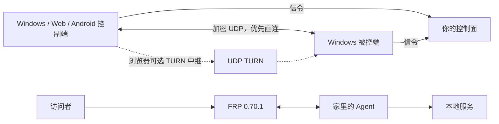

# Home Tunnel

**自托管的两条路径：授权后的 UDP 远控，以及 FRP 服务发布。**

[English](README.en.md) · [网站](https://zhanry.github.io/home-tunnel/) · [下载](docs/DOWNLOADS.md) · [快速开始](docs/GETTING_STARTED.md) · [架构](docs/ARCHITECTURE.md) · [功能矩阵](docs/FEATURE_MATRIX.md)

当前稳定组合是 **Server / Client 10.1.0 + Android 10.0.0**。Android 保留原发行文件，不重新标成 10.1.0。部分验收项目未运行，验证尚未完成，清单见 [发布说明](docs/RELEASE_NOTES.md)。FRP 保持独立的 **0.70.1**；Server / Client 使用冻结增量契约 `api-v1.5.0`。稳定通道和候选记录写在同一个 [`distribution.json`](distribution.json) 里；改这一份后运行 `python scripts/sync-distribution.py`。

## 从这里开始

| 你要做的事 | 入口 |
| --- | --- |
| 授权后远程操作一台 Windows 主机 | [快速开始 · 远控](docs/GETTING_STARTED.md) · [10.1 范围](docs/RELEASE_NOTES.md) |
| 把家里的服务发布到公网 | [快速开始 · FRP](docs/GETTING_STARTED.md) · [部署](docs/SELF_HOSTING.md) · [场景](docs/SCENARIOS.md) |
| 安装现在能用的版本 | [10.1.0 下载与校验](docs/DOWNLOADS.md) |
| 出了问题 | [排查](docs/TROUBLESHOOTING.md) · [升级](docs/UPGRADING.md) |

## 两条路径不要混用

远控要求双方登录同一台自托管服务器。被控端登录即开启被控，可以在右下角审批请求、设置固定密码，或生成一次性临时密码。载荷走端到端 DTLS 加密的 UDP，优先直连；直连失败时，浏览器控制端可以经服务器可选的 UDP TURN 中继连接 10.x 被控端，中继读不到内容。没有 TCP、FRP、HTTP 或 WSS 回退。Android 控制端和 9.x 被控端只走直连。

服务发布使用家里的 Agent 和 FRP 0.70.1。HTTP/HTTPS、TCP 和 UDP 走这条隧道。TCP/UDP 不附带 HTTP 登录保护，认证由目标应用自己完成。

## 10.1.0 的范围

10.1.0 修复 Windows 审批弹窗的底色与内容显示时机，阻止连接本机设备；原生登录可通过短时、单次、仅限远控的交接复用到远控窗口。设置与更新入口合并，当前设备改名移到“我的设备”，并改善窄窗口登录、滚动与键盘行为。登录交接和当前设备改名需要 Server 10.1.0。

10.1.0 的原始 Windows worker 字节在同机 Chromium 与生产源码 QA host 的隔离回环环境中通过 30 次连接、7202.463 秒活动和 1391 次采样；显式重启 QA host 后，新配对恢复输入耗时 3507.7 ms。 这些结果不代表完整安装版 GUI、Windows 服务、两台独立 Windows 终端、Android、断网恢复、24 小时在线或 Linux/macOS 运行验收。

10.0.0 的直连/中继、声音、剪贴板与文件开发构建实测保留在发布说明的历史部分，不能当作 10.1.0 最终字节的新增验收。24 小时测试未运行。

锁屏、登录前和 UAC 安全桌面控制不可用，也没有麦克风回传。Windows 和 macOS 仍无 Authenticode 或 Developer ID 发行签名。Android 10.0.0 保留原 applicationId、发行证书和下载摘要。SHA-256 与 Sigstore 构建证明不是发行商签名。

[8.0 历史验收](docs/8.0/ACCEPTANCE.md)、10.0.0 和 9.0.0 的历史记录只说明各自版本，不能替代 10.1.0 产物验证。

```mermaid
flowchart LR
  Controller[Windows / Web / Android 控制端] <-->|加密 UDP，优先直连| Host[Windows 被控端]
  Controller -.->|浏览器可选 TURN 中继| Relay[UDP TURN]
  Relay -.-> Host
  Controller -->|信令| Control[你的控制面]
  Host -->|信令| Control
  Visitor[访问者] --> FRP[FRP 0.70.1]
  FRP <--> Agent[家里的 Agent]
  Agent --> App[本地服务]
```

## 10.0.0 界面

以下截图保留 10.0.0 标签，不代表 10.1.0 截图。它们是实际运行的 10.0.0 Web 界面，使用本地示例数据，未发布服务或建立远控会话。
[完整界面预览](docs/site/preview.html)还包含 Android API 35 模拟器的 debug 截图；它们不能代替最终 APK 或真实 Windows 远控验收。
[截图来源、环境与校验值](docs/site/assets/v10/README.md)。

正式 Windows 便携版的原生 WebView2 登录窗口，空白隔离状态，未登录或建立远控会话：

## 参与项目

先看 [贡献指南](CONTRIBUTING.md)。反馈时写明是远控还是 FRP、组件版本和脱敏后的复现步骤。安全问题按 [SECURITY.md](SECURITY.md) 私下报告。
