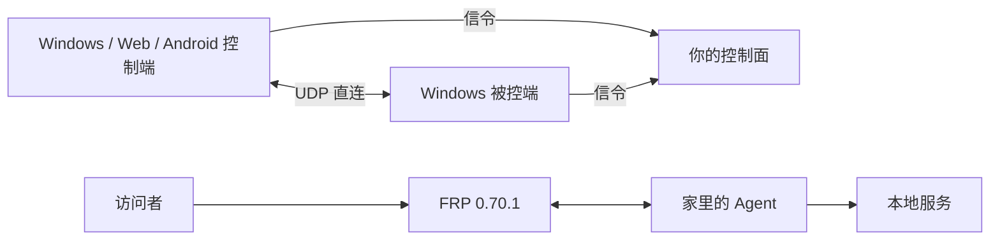

# Home Tunnel

**自托管的两条路径：授权后的 UDP 远控，以及 FRP 服务发布。**

[English](README.en.md) · [网站](https://zhanry.github.io/home-tunnel/) · [下载](docs/DOWNLOADS.md) · [快速开始](docs/GETTING_STARTED.md) · [架构](docs/ARCHITECTURE.md) · [功能矩阵](docs/FEATURE_MATRIX.md)

开发线是 **10.0.0**。当前可以安装的稳定版仍是 **9.0.0**。10.0.0 验收尚未完成，没有稳定安装包。FRP 保持独立的 **0.70.1**。稳定通道和开发线写在同一个 [`distribution.json`](distribution.json) 里；晋升时只改这一份，再运行 `python scripts/sync-distribution.py`。

## 从这里开始

| 你要做的事 | 入口 |
| --- | --- |
| 授权后远程操作一台 Windows 主机 | [快速开始 · 远控](docs/GETTING_STARTED.md) · [9.0 范围](docs/RELEASE_NOTES.md) |
| 把家里的服务发布到公网 | [快速开始 · FRP](docs/GETTING_STARTED.md) · [部署](docs/SELF_HOSTING.md) · [场景](docs/SCENARIOS.md) |
| 安装现在能用的版本 | [9.0.0 下载与校验](docs/DOWNLOADS.md) |
| 出了问题 | [排查](docs/TROUBLESHOOTING.md) · [升级](docs/UPGRADING.md) |

## 两条路径不要混用

远控要求双方登录同一台自托管服务器。被控端可以批准临时请求、设置固定密码，或生成一次性临时密码。画面和输入只走 UDP 直连。连不上就失败，不改走 TURN、ICE-TCP、FRP、HTTP 或 WSS。

服务发布使用家里的 Agent 和 FRP 0.70.1。HTTP/HTTPS、TCP 和 UDP 走这条隧道。TCP/UDP 不附带 HTTP 登录保护，认证由目标应用自己完成。

## 9.0.0 已发布，10.0.0 还没有验收

9.0.0 包含上述远控入口、独立窗口，以及原有的账号、设备、备份和监控能力。Windows 登录前、锁屏和 UAC 安全桌面尚未完成。音频没有交付。剪贴板跨端互通、arm64 APK 真机运行、跨网和长期在线仍未验收。

10.0.0 计划补上 Windows 服务/会话代理、明确开启的无人值守、系统音频、带进度和校验的双向文件，以及 FRP 发布向导。这些都还不能当成已经支持。安全桌面、音频和文件传输验收尚未完成。`api-v1.4.0` 也还没有冻结，稳定契约仍是 `api-v1.3.0`。

Windows 和 macOS 没有 Authenticode 或 Developer ID 发行证书。Android 沿用原来的 applicationId 和发行证书。SHA-256 与 Sigstore 构建证明不是发行商签名。

[8.0 历史验收](docs/8.0/ACCEPTANCE.md) 只记录当时的结果，不能代替 9.0.0 或 10.0.0 的产物。

```mermaid
flowchart LR
  Controller[Windows / Web / Android 控制端] <-->|UDP 直连| Host[Windows 被控端]
  Controller -->|信令| Control[你的控制面]
  Host -->|信令| Control
  Visitor[访问者] --> FRP[FRP 0.70.1]
  FRP <--> Agent[家里的 Agent]
  Agent --> App[本地服务]
```

下图是 7.0.0 控制台的历史截图，使用示例数据。它不是 10.0 的远控或向导界面。10.0 截图槽位见 [screenshot-slots.json](docs/site/screenshot-slots.json)。

## 参与项目

先看 [贡献指南](CONTRIBUTING.md)。反馈时写明是远控还是 FRP、组件版本和脱敏后的复现步骤。安全问题按 [SECURITY.md](SECURITY.md) 私下报告。
