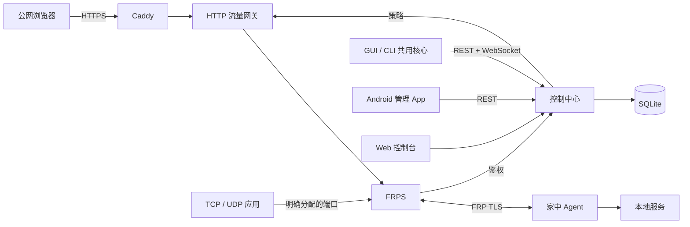

# 架构与数据路径

Home Tunnel 将控制请求与实际转发流量分开。服务端管理身份与策略，家中客户端执行允许的配置，Android 提供远程管理界面。

## 控制流程

1. 管理员创建测试账号；用户通过客户端登录并注册设备。
2. 用户或管理员创建连接，服务端校验权限、域名与端口策略。
3. 客户端同步配置及短期授权，生成受限的 FRP 配置并监督 Agent。
4. 控制台操作、配置通知、客户端心跳和错误反馈帮助观察连接状态。

## 转发流程

HTTP / HTTPS 经过 Caddy、网关和 FRPS，可使用 Web 路径的访问与流量策略。
TCP 和固定端口 UDP 直接进入 FRPS，不包含 HTTP 网关功能。
公开端口范围由部署者配置，具体端口由管理员分配。

## 运行边界

GUI 和 CLI 运行在有本地服务访问能力的电脑或 NAS 上，共用客户端逻辑。
Android 管理这些设备上的连接，不承担手机本地转发。
SQLite、服务间鉴权和内部通信保留在服务端部署边界内。

更详细的服务端边界见[服务端架构](https://github.com/ZHanry/home-tunnel-server/blob/main/docs/ARCHITECTURE.md)与[安全模型](https://github.com/ZHanry/home-tunnel-server/blob/main/docs/SECURITY_MODEL.md)。
