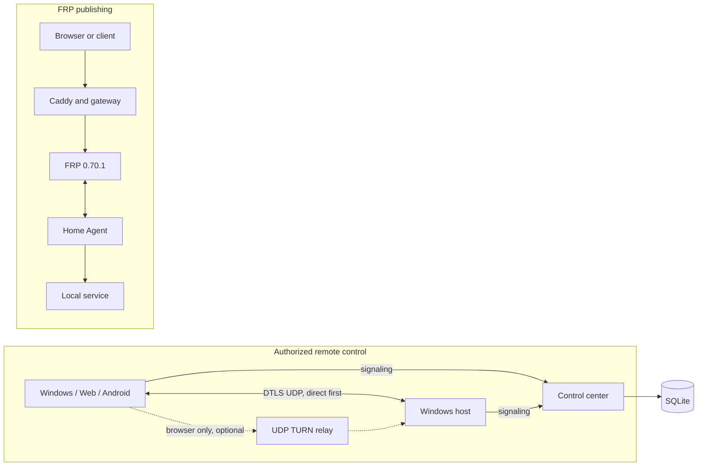

# 架构 / Architecture

Home Tunnel 有两条数据路径。控制面是同一套：账号、设备、授权和审计都在你部署的服务器上。

```mermaid
flowchart LR
  subgraph remote [Authorized remote control]
    Controller[Windows / Web / Android] <-->|DTLS UDP, direct first| Host[Windows host]
    Controller -.->|browser only, optional| Relay[UDP TURN relay]
    Relay -.-> Host
    Controller -->|signaling| Control
    Host -->|signaling| Control
  end
  subgraph tunnel [FRP publishing]
    Visitor[Browser or client] --> Edge[Caddy and gateway]
    Edge --> FRPS[FRP 0.70.1]
    FRPS <--> Agent[Home Agent]
    Agent --> Local[Local service]
  end
  Control[Control center] --> DB[(SQLite)]
```

## 远控

1. 双方登录同一台服务器。被控端批准请求，或事先准备固定密码 / 一次性临时密码。
2. 服务器签发授权并交换信令，也可以提供 STUN。控制面本身不转发画面、输入或文件。
3. 载荷走经过认证、端到端 DTLS 加密的 UDP，优先 P2P 直连。
4. 直连失败时，浏览器控制端可以经服务器可选的 UDP TURN 中继（coturn，`deploy/compose.turn.yaml`）连接 10.0.0 被控端。中继只转发加密后的 UDP，读不到内容。没有 ICE-TCP、FRP、HTTP 或 WSS 回退。Android 控制端和 9.x 被控端只走直连。

锁屏、登录前和 UAC 安全桌面控制不可用，也没有麦克风回传。

## 服务发布

1. 用户创建连接。服务端检查权限、域名和端口策略。
2. 客户端同步短期授权，生成受限的 FRP 配置并监督 Agent。
3. HTTP/HTTPS 经过 Caddy、网关和 FRPS。TCP 和固定端口 UDP 直接进入 FRPS，没有 HTTP 网关策略。
4. 公开端口范围由部署者配置，具体端口由管理员分配。

GUI 和 CLI 跑在能访问本地服务的电脑或 NAS 上。Android 管理这些设备，不在手机上做转发。

更细的服务端边界见 [服务端架构](https://github.com/ZHanry/home-tunnel-server/blob/main/docs/ARCHITECTURE.md) 和 [安全模型](https://github.com/ZHanry/home-tunnel-server/blob/main/docs/SECURITY_MODEL.md)。稳定契约是已冻结的 `api-v1.4.0`。`docs/site/schemas/api-v1.1.0.json` 只是更早的网站快照。

## English

Remote-control payloads use end-to-end DTLS-encrypted UDP between an authorized controller and a Windows host, direct first. When direct fails, a browser viewer can use the optional UDP TURN relay to reach a 10.0.0 host; the relay cannot read payloads and there is no TCP fallback. Android controllers and 9.x hosts are direct-only. The server keeps identity, authorization, signaling, and STUN. FRP 0.70.1 publishes local HTTP, TCP, and UDP services through the home Agent. The two paths do not substitute for each other. Lock screen, pre-login and UAC secure-desktop control are not available.
