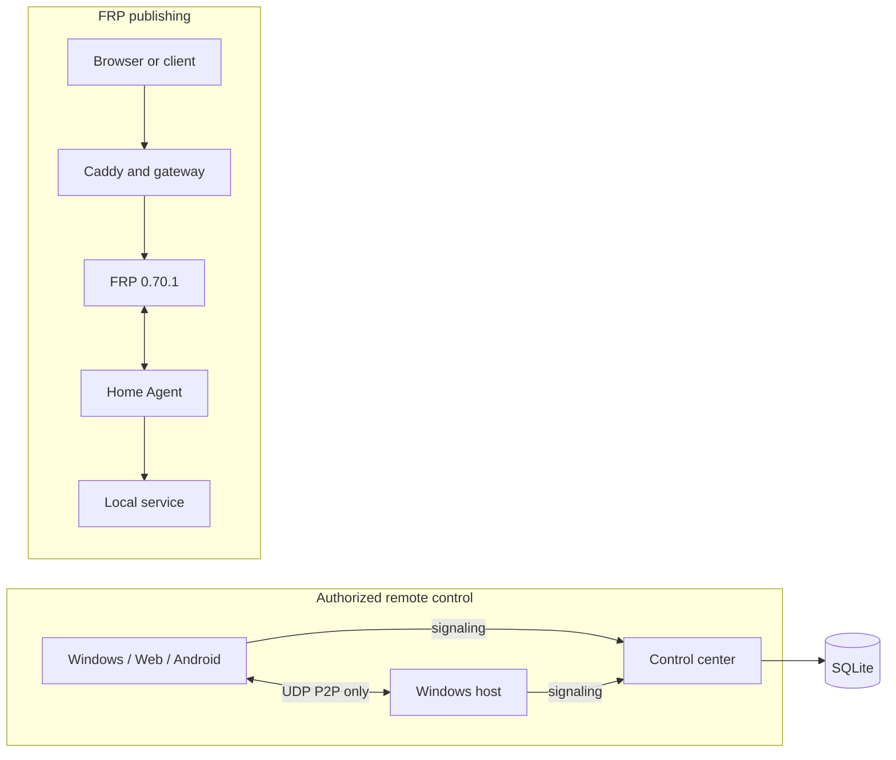

# 架构 / Architecture

Home Tunnel 有两条数据路径。控制面是同一套：账号、设备、授权和审计都在你部署的服务器上。

```mermaid
flowchart LR
  subgraph remote [Authorized remote control]
    Controller[Windows / Web / Android] <-->|UDP P2P only| Host[Windows host]
    Controller -->|signaling| Control
    Host -->|signaling| Control
  end
  subgraph tunnel [FRP publishing]
    Visitor[Browser or client] --> Edge[Caddy and gateway]
    Edge --> FRPS[FRP 0.70.1]
    FRPS <--> Agent[Home Agent]
    Agent --> Local[Local service]
  end
  Control[Control center] --> DB[(SQLite)]
```

## 远控

1. 双方登录同一台服务器。被控端批准请求，或事先准备固定密码 / 一次性临时密码。
2. 服务器签发授权并交换信令，也可以提供 STUN。它不转发画面、输入或文件。
3. 两端只通过 UDP 直连。没有路径就失败，不使用 TURN、ICE-TCP、FRP、HTTP 或 WSS 作为载荷回退。

10.0.0 计划增加 Windows 服务来处理开机、锁屏、登录和 UAC 安全桌面，以及授权后的系统音频和双向文件。这些还没有验收，架构图不把它们画成已经存在的回退路径。

## 服务发布

1. 用户创建连接。服务端检查权限、域名和端口策略。
2. 客户端同步短期授权，生成受限的 FRP 配置并监督 Agent。
3. HTTP/HTTPS 经过 Caddy、网关和 FRPS。TCP 和固定端口 UDP 直接进入 FRPS，没有 HTTP 网关策略。
4. 公开端口范围由部署者配置，具体端口由管理员分配。

GUI 和 CLI 跑在能访问本地服务的电脑或 NAS 上。Android 管理这些设备，不在手机上做转发。

更细的服务端边界见 [服务端架构](https://github.com/ZHanry/home-tunnel-server/blob/main/docs/ARCHITECTURE.md) 和 [安全模型](https://github.com/ZHanry/home-tunnel-server/blob/main/docs/SECURITY_MODEL.md)。稳定契约是 `api-v1.3.0`。`api-v1.4.0` 尚未冻结。`docs/site/schemas/api-v1.1.0.json` 只是更早的网站快照。

## English

Remote-control payloads stay on direct UDP between an authorized controller and a Windows host. The server keeps identity, authorization, signaling, and STUN. FRP 0.70.1 publishes local HTTP, TCP, and UDP services through the home Agent. The two paths do not substitute for each other. Planned 10.0 secure-desktop, audio, and file work is not an implemented fallback.
