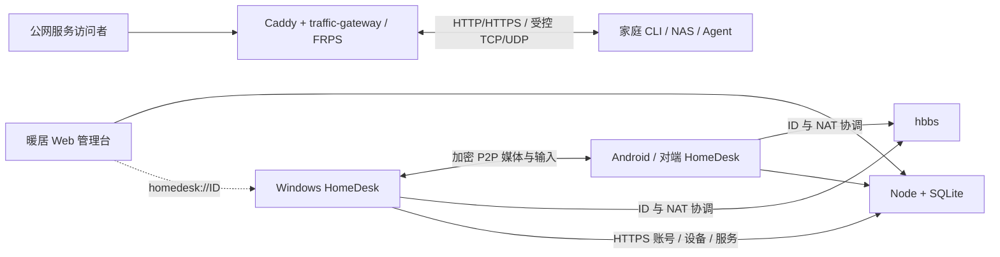

# HomeDesk 11 四仓架构

Server 保持 Node/SQLite 控制面、Caddy HTTPS 边缘、traffic-gateway 流量治理与 FRPS 穿透数据面。只新增常驻 hbbs 1.1.16，提供远控设备 ID 与 NAT 协调；固定镜像摘要，内存上限 64 MB。一次性卷初始化复用已有 FRPS 镜像，没有新增常驻数据库、Redis、TURN 或 hbbr。

Client 使用导入的 RustDesk 核心与 Flutter 暖居界面，保留原 Go CLI 和独立 Agent。所有远控入口与最终成功守卫要求认证、加密、直连；不提供中继回退。Android 通过 `homedesk-core` Git 子模块固定 Client revision，不维护复制分叉。

```mermaid
flowchart LR
  W[Windows HomeDesk] <-->|加密 P2P 媒体与输入| A[Android / 对端 HomeDesk]
  W -->|ID 与 NAT 协调| H[hbbs]
  A -->|ID 与 NAT 协调| H
  W -->|HTTPS 账号 / 设备 / 服务| C[Node + SQLite]
  A --> C
  Web[暖居 Web 管理台] --> C
  Web -.->|homedesk://ID| W
  Visitor[公网服务访问者] --> Edge[Caddy + traffic-gateway / FRPS]
  Edge <-->|HTTP/HTTPS / 受控 TCP/UDP| Agent[家庭 CLI / NAS / Agent]
```

同账号目录记录设备与原生远控 ID，写入现有 SQLite。设备撤权立即清除映射，远控 ID 全局唯一；近期登记只表示目录可发现，不能当作媒体在线。hbbs 公钥是信任锚，控制中心不持有 hbbs 私钥卷。

通用安装包无内置服务器、公钥或凭据。Windows 使用 DPAPI，Android 使用非导出的 Keystore AES-GCM 密钥；原生交接单次消费、防重放，URL 只携带设备 ID。控制中心账号权限与被控端会话授权各司其职。

内网穿透生命周期保持独立。GUI 受管 Agent 跟随窗口；独立 CLI 支持 NAS 和后台服务。远控失败、网络模式切换不会终止穿透；账号退出、授权地址改变或设备撤销仍按原权限规则停止相关受管 Agent。

旧 WebRTC 远控退出 11.x 生产路径。历史 10.x 的 DTLS/TURN 文档与证据只适用于其原始发布，不代表新的候选架构或验收。
