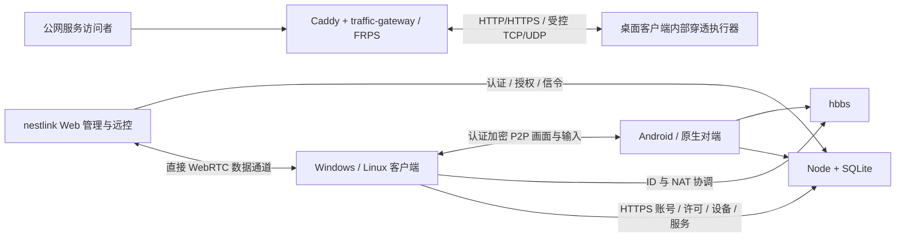

# nestlink 13.0.0 四仓架构

Server 使用 Node/SQLite 控制面、Caddy HTTPS 边缘、traffic-gateway 流量治理与 FRPS 穿透数据面。hbbs 提供原生远控设备 ID 与 NAT 协调；浏览器信令、短期连接许可和授权在同一自建服务内完成。服务端不转发远控画面，也不启用 hbbr/TURN 中继。

Client 将 Rust/Flutter 远控核心、统一工作台和内部 Go 穿透执行器组合成 Windows x64、Linux x64/ARM64 GUI。Android 以 `homedesk-core` Git 子模块固定通过验收的 Client 运行源码，提供 ARM64/x86_64 通用 APK。独立 CLI/NAS 和 macOS 不属于本次产品发行。

```mermaid
flowchart LR
  W[Windows / Linux 客户端] <-->|认证加密 P2P 画面与输入| A[Android / 原生对端]
  W -->|ID 与 NAT 协调| H[hbbs]
  A --> H
  W -->|HTTPS 账号 / 许可 / 设备 / 服务| C[Node + SQLite]
  A --> C
  Web[nestlink Web 管理与远控] -->|认证 / 授权 / 信令| C
  Web <-->|直接 WebRTC 数据通道| W
  Visitor[公网服务访问者] --> Edge[Caddy + traffic-gateway / FRPS]
  Edge <-->|HTTP/HTTPS / 受控 TCP/UDP| Tunnel[桌面客户端内部穿透执行器]
```

设备目录按账号隔离。跨账号协助在同一自建服务内按设备 ID 请求，仍须被控端批准或验证密码；目录登记不代表实时在线，也不能替代连接授权。原生核心在发起、接受连接时检查短期许可，浏览器使用独立版本的远控契约。认证契约冻结为 `api-v2.0.0`，原穿透同步及后台设备必要接口保留。

安装包不内置供应商服务器、公钥或凭据。Windows 使用 DPAPI，Linux 使用 Secret Service，Android 使用非导出 Keystore 密钥。深链接和系统入口统一检查登录，URL 不携带凭据。管理会话和后台设备凭据分别撤销。

桌面主工作台固定 1120×760，按可用屏幕和 DPI 缩小，禁止自由缩放和最大化；远控窗口保留全屏。远控与穿透分别管理生命周期：关闭远控或撤销前台会话不停止独立凭据维持的穿透，撤销对应后台设备则停止其服务。后台运行由桌面和托盘管理。

实际联调范围及未验证的真机、运营商网络、长期媒体、Wayland 和平台媒体矩阵见 [发行说明](HOMEDESK_RELEASE.md)。历史 10.x 文档与证据属于其原始发行。
